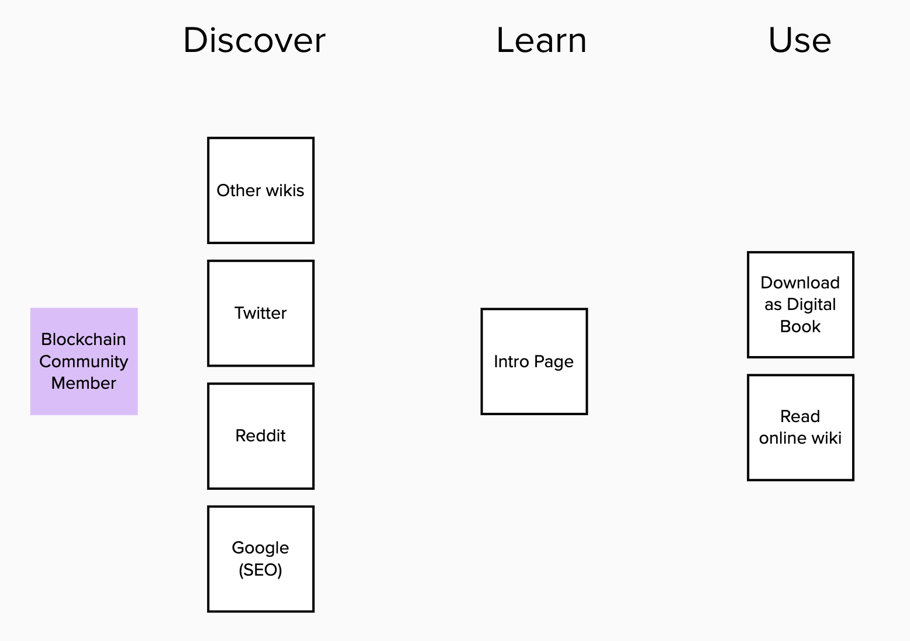

# Strategy

Purpose: Improve the efficiency of the network governance through the research

## Networks Foundations

Network Foundations \(Ethereum Foundation, Internet Foundation, Decentralized Identity Foundation\). Network is a type of organization focused on connecting members for collaboration and opportunities exchange.

* Conduct researches on [the topics]()
* Research: Funding public goods
* Partner with [ISSDG](https://issdg.org/) 

#### Decision making + Signaling

...

### Researchers

#### Collect market data

* Regular Open workshops/groups in the ecosystem and community
  * Create Partnerships work \(monthly working group call or else for more efficient research\) \#Governance \(advisors, experts\) Crash test / Ideation
* Collect / Monthly review grant programs, hackathons, [incubators / accelerators](https://wiki.4irelabs.com/docs/research/blockchain-accelerators-and-incubators)
* \(+Help scholars, ask them to help us with wiki etc\)

#### Receive funding

* [**Aragon Nest & Flock**](https://github.com/aragon/nest) ****– Aragon Nest was launched to support projects building fundamental tools and infrastructure, largely around Aragon and Ethereum.
* [**Moloch**](https://molochdao.com/) – A community DAO focused on funding Ethereum development, in the name of Moloch the God of Coordination Failure
* EF & EFC
* Commons Stack

#### Align with the market

* [https://hackmd.io/@stellarmagnet/S1YR1edJr](https://hackmd.io/@stellarmagnet/S1YR1edJr)
* Giveth gov labs
* [https://1hive.org/](https://1hive.org/)
* [ISSDG](https://issdg.org/) 

## Coops / DAOs

...

## Researchers

...

## Policies \(WIP\)

* Public Domain
* [Kanban board](https://github.com/distributed-governance/network-research/issues#workspaces/research-status-5d308fff78c7c33c6adcd325/board)
* Peer review
* Vote for the researches
* Find sponsors on specific researches

Donate even after the research is done‌

Track projects:‌

* ​[http://www.osn.global/](http://www.osn.global/)​
* ​[https://deip.world](https://deip.world/)​
* ​[https://www.ledgerback.coop/](https://www.ledgerback.coop/)​
* ISSDG
* Week in ethereum
* Ethresearch
* Blockscience
* Giveth Gov Labs
* [ISSDG](https://issdg.org/) 

## User journey

## Roles

* Coordinator – Pedro Parrachia \([@parrachia](https://twitter.com/parrachia)\)

### Coordinator

**Purpose:** coordinate to create consistency in the final report, avoid overlapping or underrepresentation of some topics or thoughts.

[Kanban board](https://trello.com/b/FN6VTD0r) \(discontinued\)

**Accountabilities:**

* Review/Request edits of materials by authors
* Managing the Scope of the report
* Assignments \(matching\) of chapter/author

