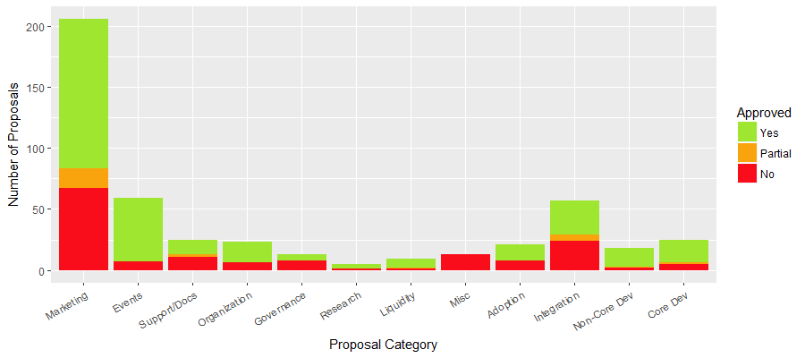

# On-chain Governance Case Studies

## Introduction

We need to make a lot of experiments and thoroughly document them in order to find a working formula for the on-chain governance. This research is dedicated to collect, categorize and compare different attempts in governance automation and scaling with blockchain systems.

Work is in progress with no final state – to be constantly updated and changed \(feel free to do pull requests\). [Discussion](https://daotalk.org/t/case-studies-decentralized-orgs-with-on-chain-governance/395) happens on the forum.

## Methodology

Structure of the report:

* Purpose
* History & key events
* Objects of governance \(e.g. repo, funds distribution\) & Used mechanics \(on-chain, off-chain\), Risk Management
* Network Stats
* Links

## Tezos \(XTZ\)

### Purpose

Tezos is a self-amending blockchain network which incorporates a formal, on-chain mechanism for proposing, selecting, testing, and activating protocol upgrades without the need to hard fork. Operates under liquid PoS consensus.

### History & key events

* 2014 – Arthur Breitman and Kathleen Breitman, started developing Tezos with a core group of developers
* 2017 – $232 million ICO
* Feb 2018 – [Dispute and Board reshuffle](https://www.coindesk.com/tezos-board-reshuffled-johann-gevers-steps)
* Jun 2018 – Testnet launch
* Sep 2018 – Mainnet Launch
* Apr 2019 – [First Exploration Vote](https://www.tezos.help/votes/)

### Objects of governance & Used mechanics

Upgrades to the protocol through proposal & voting process. Uses min quorum adapted to the average participation and and 80% of supermajority support level to pass.

* Developers independently submit proposals for protocol upgrades and request for compensation for their work.
* The request for compensation makes sure that the developers have a strong economic incentive to contribute to the ecosystem
* The proposal goes through a testing period wherein the community tests the protocol and criticizes it for possible improvements.
* After repeated testing, the Tezos token holders can then vote on whether the proposal should be approved or not.
* Once a legitimate upgrade is decided on, a “hot swap” occurs on the protocol, which initiates the new version of the protocol.

### Network Stats \(on April 2019\)

* [Market cap $0.79B](https://messari.io/asset/tezos)
* 460 bakers \(analogue of block validators\)
* 106 public delegates \(who you can delegate your XTZ tokens if you have less then 10k\)

### Links

* [Tezos Whitepaper](https://tezos.com/static/white_paper-2dc8c02267a8fb86bd67a108199441bf.pdf)
* [Tezos Wiki](https://tqgroup.gitlab.io/tezos-wiki/files/self-amendment.html)
* [Amending Tezos](https://medium.com/tezos/amending-tezos-b77949d97e1e) by Jacob Arluck
* [https://tzscan.io](https://tzscan.io/charts_bakers)
* [https://tezos.gitlab.io/master/whitedoc/voting.html](https://tezos.gitlab.io/master/whitedoc/voting.html)
* [https://www.reddit.com/r/tezos/](https://www.reddit.com/r/tezos/)
* [https://kukai.app/bakers-list](https://kukai.app/bakers-list)
* [https://mytezosbaker.com/](https://mytezosbaker.com/)
* [https://blockgeeks.com/guides/what-is-tezos/](https://blockgeeks.com/guides/what-is-tezos/)

## EOS \(EOS\)

### Purpose

Business platform for distributed apps with reliable governance, optimized for scaling and cheap/instant transactions.

### History & key events

* Mar 2018 – Technical Whitepaper
* As a result of scams and theft, leaving 7 individuals without access to their EOS on the mainnet. [The top 21 block producers at the time unanimously voted to freeze the accounts the affected accounts, without an official order from ECAF.](https://medium.com/coinmonks/a-deep-dive-into-eos-governance-49e892eeb4a2)
* After the freeze of the accounts the block producers filed a dispute against themselves, in order to have their actions reviewed by ECAF. [The actions were deemed just by an \(emergency\) arbitrator, and the freeze of 20 more accounts was ordered, sparking even more controversy, as no evidence that these accounts were in any way compromised was presented to the community.](https://medium.com/coinmonks/a-deep-dive-into-eos-governance-49e892eeb4a2)
* Sep 2018 – a Twitter account [named “Maple Leaf Capital”](https://twitter.com/MapleLeafCap/status/1046849762547372032) produced screenshots from a leaked Excel spreadsheet that supposedly show the China-based exchange Huobi, one of the world’s oldest and largest, accepting money for its support of certain entities in the charge of ensuring the network’s distributed decision-making. EOS and Huobi disproved but initiated an investigation.


But one thing I saw in the paper is that you are saying that multisig \(15/21\) needs to be for 30 days. That’s wrong. It’s referendum that needs 30 days. And that’s the old constitution. We have updated our current C with a User agreement instead.


### Objects of governance & Used mechanics 

#### Consitution and voting

[EOS has a constitution with governance features baked into the smart contract](https://github.com/EOS-Mainnet/governance/blob/master/eosio.system/eosio.system-clause-constitution-rc.md). In order to alter the constitution, the following process will have to take place:

> 1. Block producers propose a change to the constitution and obtains 15/21 approval.  
> 2. Block producers maintain 15/21 approval of the new constitution for 30 consecutive days.  
> 3. All users are required to indicate acceptance of the new constitution as a condition of future transactions being processed.  
> 4. Block producers adopt changes to the source code to reflect the change in the constitution and propose it to the blockchain using the hash of the new constitution.  
> 5. Block producers maintain 15/21 approval of the new code for 30 consecutive days.  
> 6. Changes to the code take effect 7 days later, giving all non-producing full nodes 1 week to upgrade after ratification of the source code.  
> 7. All nodes that do not upgrade to the new code shut down automatically.

The creation of an exact replica of an official \(off-chain\) ECAF order, resulting in a lot of confusion, has shown the flaws in the way official ECAF orders are given. ECAF has acknowledged this flaw and has created a way to verify orders on-chain. This method works for now, but a new, on-chain system to verify and receive official ECAF orders could help a lot.

#### ECAF

At the launch of the EOS mainnet all parties agreed on a constitution, naming ECAF \(EOS Core Arbitration Forum\). Block producers execute all of ECAF’s rulings. [Unlike Block Producers which the community chooses by voting, ECAF members are self-appointed.](https://www.reddit.com/r/eos/comments/9vo3rz/pitfalls_of_eos_governance/) 24 Block Producers have produced 64 blocks containing transactions that broke 10 ECAF Orders of Emergency Protection.

[Any EOS token holder who violates the constitution is in breach of contract, and could theoretically be subject to civil action.](https://medium.com/coinmonks/possible-improvements-to-eos-governance-7432b7afea1b)

ECAF blacklisted a number of EOS accounts that were identified as associated with fraudulent activity. [Blacklists are issued by ECAF and are delivered to block producer meetings.](https://cryptoslate.com/eos-governance-divides-crypto-community/) Block producer EosStore was not compliant with an ECAF blacklist issuance, and as a result, an account lost funds. An official [statement](https://steemit.com/statement/@eos.store/statement-of-updating-the-blacklist-from-ecaf?sort=votes) released by EosStore on June 26, 2018, confirmed the block producer did indeed neglect to update blacklist data.

#### Vote buying

> **Article IV — No Vote Buying**  
> No Member shall offer nor accept anything of value in exchange for a vote of any type, nor shall any Member unduly influence the vote of another.

Token holders can file claims against bad and/or non-complying block producers, get help with stolen accounts, and much more. Holders of capital are always looking for return. This is why people bought EOS tokens in the first place. What inevitably happens is that large token holders are able to make verbal back-room deals to commit their stake to certain block producers for certain benefits, but small token holders are not able to do this.

[Some argue it seems natural that they would \(and must\) use those tokens to support other block producers they have collaborated with and believe to be good stewards of the network.](https://medium.com/coinmonks/possible-improvements-to-eos-governance-7432b7afea1b)

> “As EOS grows and supports more use cases, those invested in the long-term success of the network will combat the forces, like vote manipulation, that degrade the long-term security of the network.” from [Aurora EOS](https://www.auroraeos.com/blog/combatting-vote-manipulation-on-eos/)

Even if Huobi isn’t buying votes now, eventually someone almost certainly will unless rules are put in place that the whole community views as legitimate.

Block.one [CEO Brendan Blumer made waves in the EOS community with a tweet](https://twitter.com/BrendanBlumer/status/1080164179091193857) suggesting that the EOS constitution be modified to allow block producers to pay dividends to users who contribute to their stake. Prosed change:

1. BPs may offer rebates.
2. Rebates will be paid to all tokens who voted, regardless of which BP they voted for, via some kind of mechanism built into the EOS blockchain.
3. Non-voting tokens will not receive rebates.

#### Participation level

[EOS voter participation is low.](https://www.auroraeos.com/blog/combatting-vote-manipulation-on-eos/) EOS governance as written does not work well with exchanges, which have custody over a vast amount of user cryptocurrency. [Perhaps more importantly, there’s no way to prevent exchanges from voting the tokens of their users who don’t care to vote.](https://www.coindesk.com/vitalik-called-it-vote-buying-scandal-stokes-fears-of-eos-failure) 

Bitfinex has written open source software [to enfranchise its users](https://support.bitfinex.com/hc/en-us/articles/360005324573-Bitfinex-Ballot-EOS-Block-Producer-Voting), but it has limitations. We do not know of any other exchanges that have implemented it or anything similar.

### Network Stats \(on April 2019\)

* [Market cap $4.8B](https://coinmarketcap.com/currencies/eos/)
* [25M blocks generated](https://www.reddit.com/r/eos/comments/9vo3rz/pitfalls_of_eos_governance/)
* [17 Orders issued by ECAF](https://www.reddit.com/r/eos/comments/9vo3rz/pitfalls_of_eos_governance/)
* [62k EOS lost by misbehavior ](https://www.reddit.com/r/eos/comments/9vo3rz/pitfalls_of_eos_governance/)\(~$300k\)

### Links

* [EOS Technical White Paper v2](https://github.com/EOSIO/Documentation/blob/master/TechnicalWhitePaper.md)
* [A Deep Dive Into EOS Governance](https://medium.com/coinmonks/a-deep-dive-into-eos-governance-49e892eeb4a2)
* [An Alternative EOS Staking Algorithm](https://medium.com/@kengriffith_54628/an-alternative-eos-staking-algorithm-4f3519cc7157)
* [Risk-Reward Based Governance for EOS](https://medium.com/coinmonks/possible-improvements-to-eos-governance-7432b7afea1b)
* [https://cryptodaily.co.uk/2019/04/eos-constitution-changed-voting-impasse](https://cryptodaily.co.uk/2019/04/eos-constitution-changed-voting-impasse), check new constitution

## DASH

### Purpose

[Digital Cash, peer-to-peer digital currency.](https://www.dash.org/learning-resources/)

### History & key events

* January 2014 launched as "Xcoin"
* Rebranded to Darkcoin \(2015\) and then Dash \(2016\)
* February 2018, [a legal entity was formed which represents the DAO, and this entity took ownership of Dash Core](https://www.dashforcenews.com/dash-core-group-becomes-first-legally-dao-owned-entity/)

### Objects of governance & Used mechanics 

#### Masternodes

[Masternode Operators \(MNOs\) are key actors in the Dash network. ](https://medium.com/@richardred/observations-of-the-dash-treasury-dao-c94231b2b5c4)Dash Masternodes \(MNs\) provide certain services \(InstantSend and PrivateSend\) to users, receive 45% of the block reward, and collectively control the project’s development fund through voting. A MNO can operate multiple MNs.

#### Treasury

Each month, DASH dispenses 10% of the block rewards for that month in a superblock. This DASH is distributed to the wallets associated with treasury budget proposals which have scored highly enough to receive a payout. MNOs vote Yes, No or Abstain to proposals, on the basis of one vote per MN. Money is available by default, not allocated budget coins are not minted.

#### Funds distribution

There is a [voting threshold which determines whether a proposal will be funded](https://docs.dash.org/en/latest/governance.html#budgets-and-masternode-voting): a net Yes vote greater than 10% of all MNs. The threshold formula is: \(YES votes — NO votes\) &gt; \(Total Number of Masternodes / 10\). Formal submission of a proposal costs a fee of 5 DASH.

### Network Stats \(on April 2019\)

* 6,176 DASH distributed on April \(~$730k\), around that amount is distributed on monthly basis
* 4,769 masternode
* 295 proposals approved out of 474
* 18.7% – median amount of masternode participation

### Links

* [Dash Governance](https://www.dash.org/governance/%20)
* [Observations of the Dash Treasury DAO](https://medium.com/@richardred/observations-of-the-dash-treasury-dao-c94231b2b5c4)
* [Dash Central](https://www.dashcentral.org/)

## Aragon Network

### Purpose

Aragon Network will be the first community governed decentralized organization whose goal is to act as a digital jurisdiction, an online decentralized court system that isn’t bound by traditional artificial barriers such as national identity or the borders of a single country.

### History & key events

* May 2017 – Aragon Raised $25M \(at ETH price ~$150\)
* Dec 2017 – [Launch of Aragon Nest Program](https://blog.aragon.org/introducing-aragon-nest-1aa8c91c0566/)
* May 2018 – [Separation Aragon Association \(non profit\) and Aragon One \(dev team\)](https://blog.aragon.org/introducing-aragon-one-b14dd804c5ce/)
* Oct 2018 –[ Launch of Flock program \(bigger grants for teams\)](https://blog.aragon.org/flock-funding-for-aragon-teams/)
* Nov 2018 – AGP-1 vote
* Mar 2019 – AGP-2 vote

### Objects of governance

#### Association

Aragon network is stewarded by the Aragon Association, Swiss registered non-profit entity. Executive director is Stefano Bernardi. Luis Cuende & Jorge Izquierdo \(founders\) are on the board of directors.  It controls the pool of funds raised through ICO and private rounds \(Placeholder, Boost VC etc\). It controls ~18% of undistributed ANT \(governance tokens\). Here's the [list of current holders](https://etherscan.io/token/0x960b236A07cf122663c4303350609A66A7B288C0#balances) to check the distribution.

The management of funds recently became governed through the AGP process \(described below\) where token holders vote for or agains specific decisions \(not only funds dedication\). Association keeps open [multisig balance and operations](https://transparency.aragon.org/), provides quarterly reports on the funds usage. It formed [the Manifesto](https://blog.aragon.org/the-aragon-manifesto-4a21212eac03/) to guide the values for further platform development and governance. 

The initial development team is formed as a separate entity Aragon One \(Estonia based\), which requests yearly budgets from the association. It has the write \(ownership?\) access over the main project repository. It provides regular updates on the roadmap and performance. 

#### AGPs

Aragon Governance Proposals \(AGPs\) are documents that propose changes to the [governance of the Aragon project](https://aragon.org/project/governance). The process is described in the [AGP-1](https://github.com/aragon/AGPs/blob/master/AGPs/AGP-1.md) approved on November 2018. It had support level of 99.97%, however only 2.6% of tokens participated in the decision. AGPs are openly submitted and tracked via the [github repository](https://github.com/aragon/AGPs).

Next big AGP \(\#2\) 

* 1, 2 results, discussions, outcomes
* [https://blog.aragon.org/final-results-from-the-agp-1-vote/](https://blog.aragon.org/final-results-from-the-agp-1-vote/)
* * [https://medium.com/paradigm-fund/aragon-final-results-from-network-vote-2-massively-influenced-by-one-whale-that-planning-suite-8e2201c808b7](https://medium.com/paradigm-fund/aragon-final-results-from-network-vote-2-massively-influenced-by-one-whale-that-planning-suite-8e2201c808b7)
* [https://forum.aragon.org/t/evaluating-the-agp-1-voting-results-makes-me-think-we-need-an-aragon-community-token-act/290](https://forum.aragon.org/t/evaluating-the-agp-1-voting-results-makes-me-think-we-need-an-aragon-community-token-act/290)

#### Nest & Flock programs

* purpose, github mechanics
* [https://blog.aragon.org/flock-funding-for-aragon-teams/](https://blog.aragon.org/flock-funding-for-aragon-teams/)
* [https://blog.aragon.org/aragon-nest-update-evolution-of-the-grants-program/](https://blog.aragon.org/aragon-nest-update-evolution-of-the-grants-program/)

### Network Stats

* Funds under management ~$53M on May 2019
* Voting activity
* Proposals by program
* Funds distributed

### Links

* [https://wiki.aragon.org/](https://wiki.aragon.org/)
* [https://blog.aragon.org/why-transparency-matters-d6f9e6e10985/](https://blog.aragon.org/why-transparency-matters-d6f9e6e10985/)

## Genesis 

* [https://medium.com/daostack/daostack-update-mainnet-launch-genesis-alpha-dao-plantoid-media-roundup-dappcon-f724fc7133aa](https://medium.com/daostack/daostack-update-mainnet-launch-genesis-alpha-dao-plantoid-media-roundup-dappcon-f724fc7133aa)

Based on Alchemy

### Maker DAO

* [https://medium.com/makerdao/makerdao-governance-risk-framework-38625f514101](https://medium.com/makerdao/makerdao-governance-risk-framework-38625f514101)
* [https://medium.com/@visionhill\_/a-makerdao-case-study-47a31d858be5](https://medium.com/@visionhill_/a-makerdao-case-study-47a31d858be5)
* [https://fitznerblockchain.consulting/maker-governance-exploring-the-importance-of-stability-fees/](https://fitznerblockchain.consulting/maker-governance-exploring-the-importance-of-stability-fees/)

## Decred

* [https://proposals.decred.org/](https://proposals.decred.org/)

