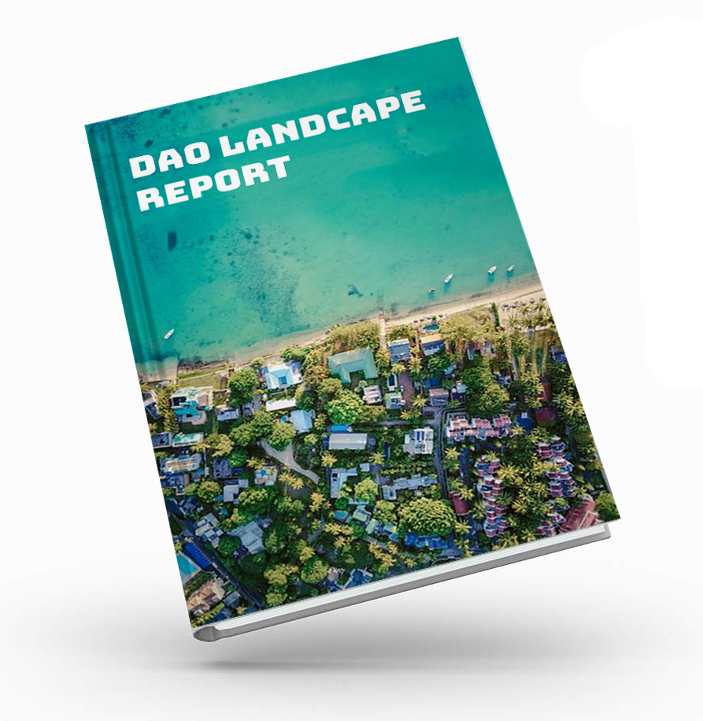

# About

We are proposing a research project to map the current landscape of DAOs in the industry. The purpose of the research is so that we will have a body of knowledge of what organizations there are, what legal and technical frameworks they are using, and what the gaps are in the industry. In stage 1, we will focus on researching the technologies available \(**Industry Map**\) and the technologies and frameworks implemented by existing DAOs \(**Framework**\). 

The information gleaned with this project will be publically available on the **DGOV Wiki** and will be made available to other Wikis and bodies of knowledge that are public to our community. Conclusions and findings will be published in a **Medium / HackerNoon blog**. The wiki is open and knowledge can be easily added to the framework. The purpose of this research is to allow for DAOs to see what the best practices \(or at leas the current practices\) are, and to be able to use the body of knowledge to implement their own DAO technologies. 

The research will also show **the gaps** in our current landscape, providing opportunities for entrepreneurs to know where there are gaps that still need to be filled in the framework. Throughout the project, I will work collaboratively with others in the industry and seek feedback from the communities to ensure that we get as complete a picture as possible. At all stages of the project \(including this proposal stage\), feedback is welcome.

_Adapted from the_ [_original proposal_](https://docs.google.com/spreadsheets/d/1pQrfzQMafzrsXt66ZzJBTjm20qeLXoUFX51ptRywLm4/edit#gid=1194219037)_:_

## **Purpose**

Inform the community & wider blockchain audience on

* knowledge for to-be-DAOs \(e.g. best practices on things like proposal making\)
* interoperability gaps

Criteria for the success - answer the questions:

* What is DAO?
* Who uses it and for what?
* How does it work?
* What tools are present?
* How do they compare?
* ...

Part of \#dgov network

